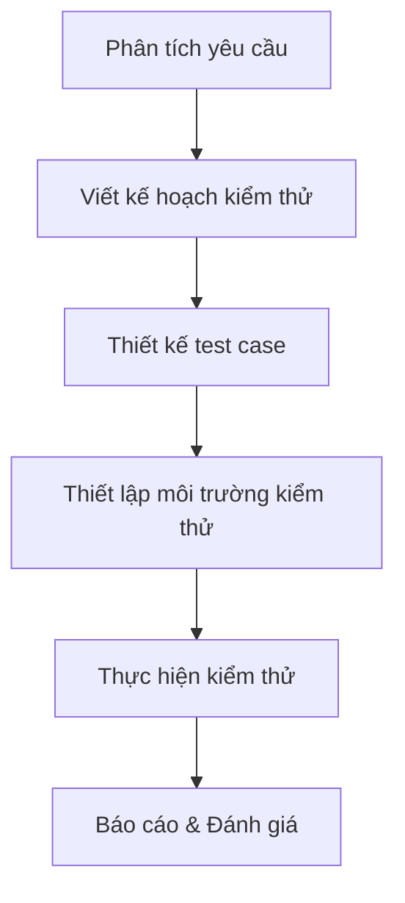

# 🧪 Software Testing

## 1. Khái niệm

**Software Testing** là quá trình đánh giá và xác minh rằng một phần mềm hoặc ứng dụng hoạt động đúng như mong đợi. Mục tiêu chính là phát hiện lỗi, đảm bảo chất lượng và độ tin cậy của sản phẩm trước khi phát hành.

> "Testing shows the presence, not the absence of bugs." — Edsger Dijkstra

## 2. Vai trò của Software Testing
- Đảm bảo phần mềm đáp ứng yêu cầu người dùng
- Phát hiện và sửa lỗi trước khi triển khai
- Nâng cao chất lượng, độ tin cậy và bảo mật
- Giảm chi phí bảo trì về sau

## 3. Phân loại Software Testing

### 3.1. Theo phương pháp
- **Manual Testing**: Kiểm thử thủ công, không sử dụng công cụ tự động.
- **Automation Testing**: Sử dụng công cụ/tập lệnh để kiểm thử tự động.

### 3.2. Theo mức độ
- **Unit Testing**: Kiểm thử từng đơn vị nhỏ nhất (hàm, class).
- **Integration Testing**: Kiểm thử sự kết hợp giữa các module.
- **System Testing**: Kiểm thử toàn bộ hệ thống.
- **Acceptance Testing**: Kiểm thử nghiệm thu, xác nhận đáp ứng yêu cầu.

### 3.3. Theo mục tiêu
- **Functional Testing**: Kiểm thử chức năng phần mềm.
- **Non-functional Testing**: Kiểm thử hiệu năng, bảo mật, khả dụng, v.v.

## 4. Quy trình kiểm thử phần mềm

## 5. Một số công cụ phổ biến
- **Manual**: TestRail, Zephyr
- **Automation**: Selenium, JUnit, PHPUnit, Cypress

## 6. Tài liệu tham khảo
- [ISTQB Foundation Level Syllabus](https://www.istqb.org/downloads/category/2-foundation-level-documents.html)
- [Software Testing Fundamentals](https://softwaretestingfundamentals.com/)
- [Wikipedia: Software Testing](https://en.wikipedia.org/wiki/Software_testing)

---

> **Tip:** Hãy kiểm thử sớm và kiểm thử thường xuyên để đảm bảo chất lượng phần mềm!
